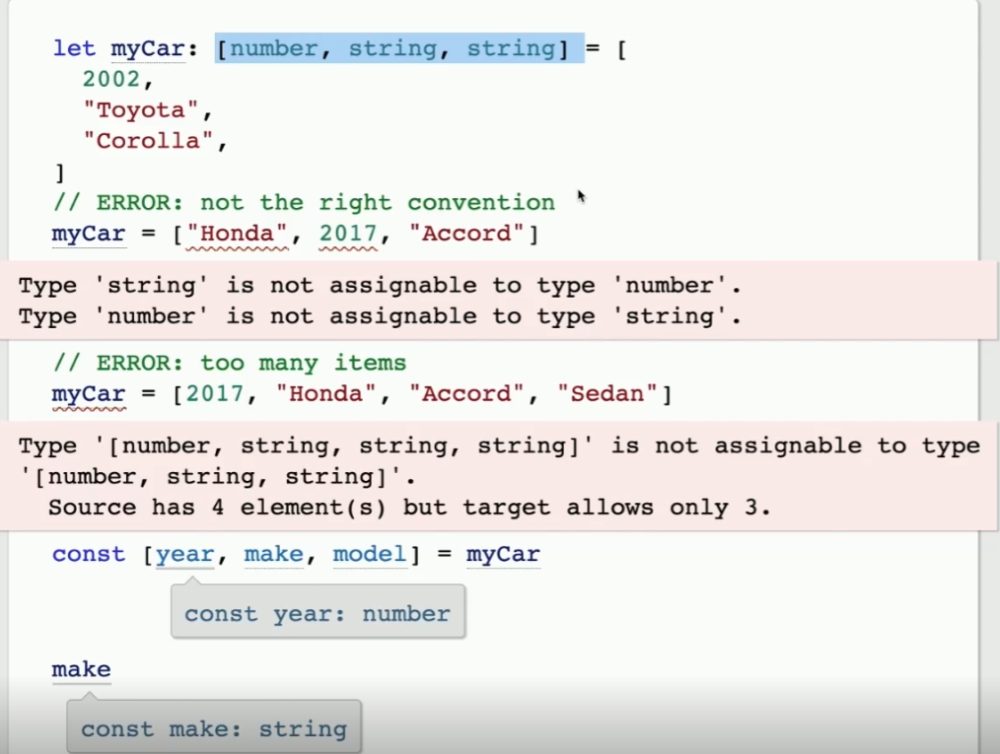

https://www.typescriptlang.org/docs/handbook/typescript-from-scratch.html

## Type driven development
* This results in  add(3,4) being highlighted
```
function add(a: number, b: number): number { return null }
add(add(3,4), 5)
```
* This results in number being highlighted
```
function add(a: number, b: number): number {}
add(3, add(5, 1))
```

## Top option is correct, bottom requires an undefined to be passed in
```
chargeVoltage?: number
chargeVoltage: number | undefined

printCar({
    make: 'Toyota', model: 'Corolla', year: 2002,
    chargeVoltage: undefined
})
```

## Excess property checking - too many properties for the declaration

## Index signature
```
const phones: {
    [k: string] : {
        country: stirng
        area: string
        number: string
    } | undefined
} = {}

phones.fax = {
    country: string;
    area: string;
    number: string;
}
```
Adding undefined makes sure fax is available

## Tuples
- Tuple types allow you to express an array with a fixed number of elements whose types are known, but need not be the same. For example, you may want to represent a value as a pair of a string and a number:



## Static vs Dynamic typing
- Static would include Typescript, C++, Java, other compiled languages
- Dynamic includes Javascript. Only checks for whether something works, can blow up at runtime.

## Typeguards
```
// Argument of type 'string | number' is not assignable to parameter of type 'number'. Type 'string' is not assignable to type 'number'.

function padLeft(padding: number | string, input: string) {
  return " ".repeat(padding) + input;  
}

// Correct
function padLeft(padding: number | string, input: string) {
  if (typeof padding === "number") {
    return " ".repeat(padding) + input;
  }
  return padding + input;
}
```
## Tagged/Discriminated Union type
- TypeScript understands that the first and second positions of our tuple are linked. Basically an "and" operator.

```
const outcome = maybeGetUserInfo()
if (outcome[0] === "error") {
  // In this branch of your code, second is an Error
  outcome -> const outcome: ["error", Error]    
} else {
  // In this branch of your code, second is the user info
  outcome ->     
    const outcome: ["success", {
        name: string;
        email: string;
    }]
}
```
## Union type
- Not commonly used, but the type returned by all properties of both types. Basically an "or" operator, the resulting object has to have properties of both types.
```
function makeWeek(): Date & { end: Date } {
  //⬅ return type
 
  const start = new Date()
  const end = new Date(start.valueOf() + ONE_WEEK)
 
  return { ...start, end } // kind of Object.assign
}
 
const thisWeek = makeWeek()
thisWeek.toISOString()   
    //const thisWeek: Date & {
        end: Date;
    }
thisWeek.end.toISOString()         
    // (property) end: Date
```


## Interface vs Type Aliases
Type aliases
- Type aliases cannot be redeclared in the same scope
- Import/export types
```
export type UserContactInfo = {
    name: string
    email: string
}

function printContactInfo(info: UserContactInfo)

const painter = {
    name: "Rob"
    email: "rob@blah.com
    favoriteColor: "blue"
}

printContactInfo(painter)
// Still works, even with the extra type

type UserInfoOutcomeError = ["error", Error]
type UserInfoOutcomeSuccess = [
  "success",
  { name: string; email: string }
]
type UserInfoOutcome =
  | UserInfoOutcomeError
  | UserInfoOutcomeSuccess  
```

Interfaces
- You can implement type aliases, but best to only implement interfaces
- Interfaces are global and not unique. If you redeclare the interface, the new properties will be added onto the older interface declaration. This allows you to add a type onto a library's type defs.
- Use an interface to allow consumers of the type to augment them
```
interface AnimalLike {
  eat(food): void
}
 
class Dog implements AnimalLike {
Class 'Dog' incorrectly implements interface 'AnimalLike'.
  Property 'eat' is missing in type 'Dog' but required in type 'AnimalLike'.
  bark() {
    return "woof"
  }
}
```
Recursive types
```
type NestedNumbers = number | NestedNumbers[]
 
const val: NestedNumbers = [3, 4, [5, 6, [7], 59], 221]
 
if (typeof val !== "number") {
  val.push(41)
       
(method) Array<NestedNumbers>.push(...items: NestedNumbers[]): number
  val.push("this will not work")
Argument of type 'string' is not assignable to parameter of type 'NestedNumbers'.
}
```

## Functions
```
interface TwoNumberCalculation {
  (x: number, y: number): number
}
 
type TwoNumberCalc = (x: number, y: number) => number
 
const add: TwoNumberCalculation = (a, b) => a + b
    //(parameter) a: number
const subtract: TwoNumberCalc = (x, y) => xy                        
    // (parameter) x: number
```

*  Void vs Undefined 
```
// This will complain that number is not assignable to undefined, but will work with void

const values: number[] = []

function invokeinFourSeconds(callback: () => undefined) {
    setTimeout(callback, 4000)
}
function invokeinFiveSeconds(callback: () => undefined) {
    setTimeout(callback, 5000)
}
```

* Construct signatures
```
interface DateConstructor {
    new (value: number): Date
}
```

* Functions
    - Allows multiple options for the implementation, to improve specificity
    - The implementation must have all of the elements in the function declaration
    - 'this' can be declared as a type with a return type in the function declaration. Used with .bind, .call, .apply

* Access modfiers (same as C#), probably more useful for Node
    - public - everyone
    - protected - the instance itself, and subclasses
    - private - only the instance itself
    - private fields
        - #year on a Car class

    - readonly modifier - basically operates like a const, but for classes

* Param Properties
```
class Car {
    make: string
    model: string
    year: number
    constructor(make: string, model: string, year: number) {
        this.make = make
        this.model = model
        this.year = year
    }
}
```
vs
```
class Car {
  constructor(
    public make: string,
    public model: string,
    public year: number
  ) {}
}
 
const myCar = new Car("Honda", "Accord", 2017)
myCar.make
```
# Top types
- Unknown type
```
let flexible: unknown = 4
flexible = "Download more ram"
flexible = window.document
flexible = setTimeout
```

But, Values with an unknown type cannot be used without a type guard
```
if (typeof myUnknown === "string") {
    // This will work
} 
else {
    // this would run for "the leftovers"
        { myUnkown | anything except string }
}
```
# Bottom types
- Never types
    - Exhaustive conditional
```
class Car {
  drive() {
    console.log("vroom")
  }
}
class Truck {
  tow() {
    console.log("dragging something")
  }
}
type Vehicle = Truck | Car
 
let myVehicle: Vehicle = obtainRandomVehicle()
 
// The exhaustive conditional
if (myVehicle instanceof Truck) {
  myVehicle.tow() // Truck
} else if (myVehicle instanceof Car) {
  myVehicle.drive() // Car
} else {
  // NEITHER!
  const neverValue: never = myVehicle
}
```

Then if we try to add a Boat

```
Try
Now, leaving the conditional exactly as-is, let’s add Boat as a vehicle type:

class Car {
  drive() {
    console.log("vroom")
  }
}
class Truck {
  tow() {
    console.log("dragging something")
  }
}
class Boat {
  isFloating() {
    return true
  }
}
type Vehicle = Truck | Car | Boat
 
let myVehicle: Vehicle = obtainRandomVehicle()
 
// The exhaustive conditional
if (myVehicle instanceof Truck) {
  myVehicle.tow() // Truck
} else if (myVehicle instanceof Car) {
  myVehicle.drive() // Car
} else {
  // NEITHER!
  const neverValue: never = myVehicle
Type 'Boat' is not assignable to type 'never'.
}
```

This is helpful for large javascript projects, so the person adding that Boat class knowns where to update files. 

```
class UnreachableError extends Error {
  constructor(_nvr: never, message: string) {
    super(message)
  }
}
 
// The exhaustive conditional
if (myVehicle instanceof Truck) {
  myVehicle.tow() // Truck
} else if (myVehicle instanceof Car) {
  myVehicle.drive() // Car
} else {
  // NEITHER!
  throw new UnreachableError(
    myVehicle,
// Argument of type 'Boat' is not assignable to parameter of type 'never'.
    `Unexpected vehicle type: ${myVehicle}`
  )
}
```

# Type guards & Narrowing
- Useful for assertions for testing

# Nullish Values
- The non-null assertion operator (!.) is used to cast away the possibility that a value might be null or undefined.

- The definite assignment !: operator is used to suppress TypeScript’s objections about a class field being used, when it can’t be proven1 that it was initialized.

```
class ThingWithAsyncSetup {
  setupPromise: Promise<any> // ignore the <any> for now
  isSetup: boolean
Property 'isSetup' has no initializer and is not definitely assigned in the constructor.
 
  constructor() {
    this.setupPromise = new Promise((resolve) => {
      this.isSetup = false
      return this.doSetup(resolve)
    }).then(() => {
      this.isSetup = true
    })
  }
 
  private async doSetup(resolve: (value: unknown) => void) {
    // some async stuff
  }
}
```

- The function passed into the Promise constructor is invoked synchronously, meaning by the time we receive our instance of ThingWithAsyncSetup, the isSetup property will most certainly have a value of false.

# Generics
- Use each type parameter at least twice, or you can end up type casting accidentally

```
function returnAs<T>(arg: any): T {
  return arg // 🚨 an `any` that will _seem_ like a `T`         
    ((parameter) arg: any)
}
 
// 🚨 DANGER! 🚨
const first = returnAs<number>(window)       
    (const first: number)

const sameAs = window as any as number        
    (const sameAs: number)
```
- Define type parameteres as simply as possible. 
```
interface HasId {
  id: string
}
interface Dict<T> {
  [k: string]: T
}
 
 // We don't know what T is. This results in more complicated code.
function ex1<T extends HasId[]>(list: T) {
  return list.pop()          
    (TOOLTIP: (parameter) list: T extends HasId[])
    (function ex1<T extends HasID[]>(list: T): HasId : undefined)
}

// Push parameteres to lowest level
function ex2<T extends HasId>(list: T[]) {
  return list.pop()          
    (TOOLTIP: (parameter) list: T[])
    (function ex2<T extends HasID>(list: T[]) | undefined)
}
```
- The important thing here is that HasID[]>(list: T) is simpler