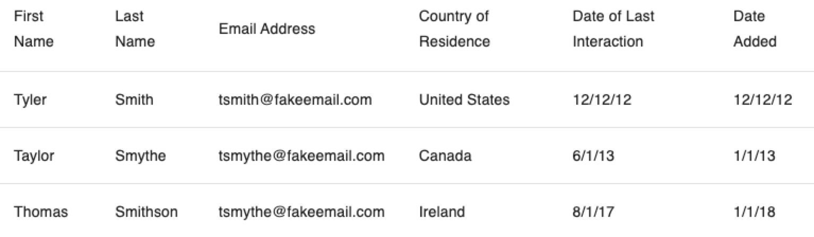

## Design TinyUrl
- Given a URL, our service should generate a shorter and unique alias of it. This is called a short link. This link should be short enough to be easily copied and pasted into applications.
- When users access a short link, our service should redirect them to the original link.
- Users should optionally be able to pick a custom short link for their URL.
- Links will expire after a standard default timespan. Users should be able to specify the expiration time.

# Assumptions
Let’s assume a 100:1 ratio between read and write.

# Database
The data isn't very relational, so prefer NOSQL
URL-> originalURL, created, expires, userid
User -> name, email, created, lastlogin

# Encoding the URL
Generate MD5 or SHA256 hash of the URL with base64 encoding
Using base64 encoding, a 6 letters long key would result in 64^6 = ~68.7 billion possible strings.

# Infrastructure
Client -> LoadBalancer -> Web Server -> Write & Read API -> Memory Cache -> DB

# APIs
createURL
deleteURL

## Load balancer
One public IP address for traffic to hit, then the balancer figures out where to route traffic to private ip addresses of servers
- The load balancer can query the servers to see which has the least load to send traffic to
- Each server could host different materials, and the LB can know which to route to
- Round-robin distribution

## How would you go about creating this react component? 

https://github.com/donnemartin/system-design-primer
https://github.com/donnemartin/interactive-coding-challenges